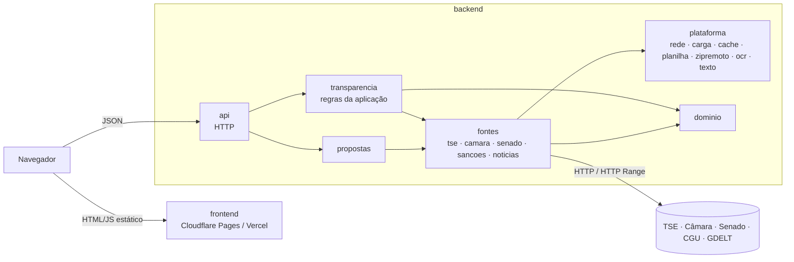

# Arquitetura

O Quem eu voto é um monorepo com duas aplicações independentes:

- **backend/**: API em Go que lê as fontes oficiais, cruza os dados e entrega JSON pronto.
- **frontend/**: site estático em React que só consome essa API.

Não há banco de dados. Todas as fontes são públicas e recarregadas periodicamente: os índices
ficam em memória e o que é caro de obter fica numa cache em disco.

## Backend: camadas

| Camada                       | Responsabilidade                                                          | Pode depender de                         |
| ---------------------------- | ------------------------------------------------------------------------- | ---------------------------------------- |
| `cmd/api`                    | ler a configuração, criar os serviços, subir e encerrar o servidor        | tudo                                     |
| `internal/api`               | HTTP: rotas, middlewares, ler parâmetros, traduzir erros em status        | `transparencia`, `propostas`, `fontes`, `dominio` |
| `internal/transparencia`     | regras da aplicação: o que cada tela mostra e como os dados se cruzam     | `fontes`, `propostas`, `dominio`, `plataforma` |
| `internal/propostas`         | propostas de governo: PDF, extração de texto, OCR, resumo por tema        | `fontes/tse`, `dominio`, `plataforma`    |
| `internal/fontes/*`          | um adaptador por fonte oficial: baixar, ler o formato, montar índices     | `dominio`, `plataforma` (nunca outra fonte) |
| `internal/dominio`           | conceitos partilhados (calendário, cargos, UFs, tipos simples)            | `plataforma/texto`                       |
| `internal/plataforma/*`      | infraestrutura genérica, sem regra de negócio                             | outros pacotes de `plataforma`           |
| `internal/config`            | variáveis de ambiente                                                     | nenhum pacote interno                    |

Regras:

1. **Dependências só descem.** Uma fonte nunca importa `transparencia` nem `api`, e a
   `plataforma` não conhece nenhuma fonte. O compilador impede ciclos; o teste
   `internal/arquitetura_test.go` aplica a tabela acima e falha se alguém a violar.
2. **`api` não tem regra de negócio.** Cada handler lê os parâmetros, chama um método do serviço e
   escreve o resultado. Validação, filtros, ordenação e paginação ficam em `transparencia`.
3. **Erros tipados.** O serviço devolve `*transparencia.Erro` com um tipo (`EntradaInvalida`,
   `NaoEncontrado`, `Indisponivel`) e uma mensagem para o usuário; a `api` converte em
   400/404/502 num único lugar (`responderErro`). Pedidos cancelados não recebem resposta.
4. **As fontes degradam bem.** Se uma fonte oficial cair, a resposta sai com o que houver e um
   aviso em `avisos`, em vez de falhar inteira. A Câmara, por exemplo, tem no máximo 8 s para
   responder na lista de candidatos.

## Backend: dados em memória

- `carga.Periodico[T]` recarrega um índice em segundo plano (de 6 h em 6 h a 24 h em 24 h, conforme a
  fonte). Quem pede espera só pela primeira carga; depois recebe sempre o último valor bom.
- `carga.PorID[T]` guarda valores por deputado/senador com TTL, junta pedidos simultâneos para o
  mesmo ID e limita a 8 pedidos em paralelo às APIs.
- `cache` grava em disco o que demora a obter (lista da Câmara, contas de campanha, análises de
  propostas), para o servidor voltar rápido depois de um reinício.
- Arquivos de vários GB do TSE (fotos, votação) são lidos com `zipremoto`, por HTTP Range: só o
  índice do zip e as entradas necessárias são baixados.

## Frontend

Organizado por funcionalidade (`features/`), com componentes partilhados em `components/` e um
único cliente HTTP em `services/api.js`. Detalhes em [frontend/README.md](../frontend/README.md).

## Como estender

**Nova fonte de dados:** crie `internal/fontes/<fonte>` com uma função `Carregar…(ctx) (*Indice, error)`,
registre um `carga.NovoPeriodico` em `transparencia.Novo` e chame `Executar` em `Iniciar`. Use
`plataforma/rede` para HTTP e `plataforma/planilha` para CSV.

**Novo endpoint:** escreva o método no `transparencia.Servico` (validação e erros tipados incluídos),
crie um handler de poucas linhas em `internal/api` e registre a rota em `NovoRoteador`. Acrescente
um caso em `internal/api/rotas_test.go`.

**Nova tela:** crie `frontend/src/features/<nome>/`, use `buscarAPI` de `services/api.js` e
adicione o item em `app/rotas.js`.
